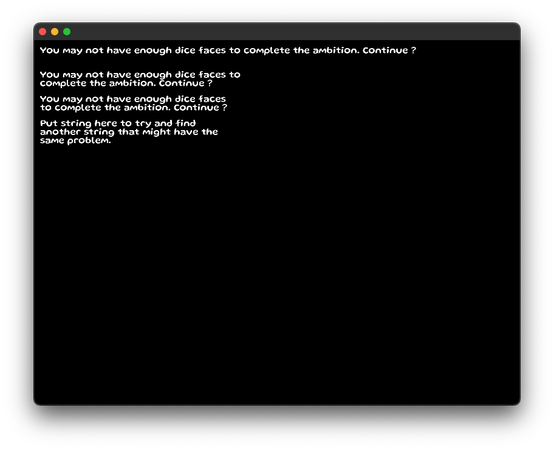

# To run

make && hl run.hl

# Prereq

- haxe 4.2.5
- heaps: 4120f370c5242d20cf3d9b50eb0c89ca02c87211
- font: Gluten

# Bug

The first text has a maxWidth of 330.

The second and third text have a maxWidth of 331 and 329 respectively.
The bug only happens at 330 and the text did not wrap.

The 4th text is for anyone who want to try to find another string that have this bug.
